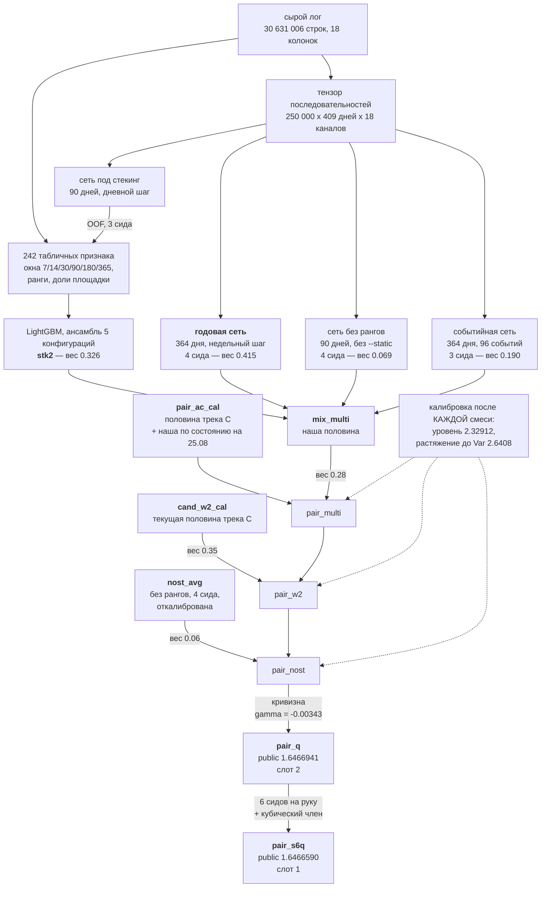

# Задача 3: второе место на private, RMSLE 1.6615862555

Предсказание суммарного GMV пользователя Поиска за 30 дней (14.02–15.03.2026)
по дневному логу активности. Метрика — RMSLE.

С шестнадцатого места на public. **Четырнадцать позиций** — и они выиграны
не в последний день, а решением, записанным за двое суток до закрытия
лидерборда.

**Расчёт был сделан заранее и подтвердился.** 29.08, находясь на 16-м месте,
мы посчитали: команда, выбирающая финал как лучший из N кандидатов по паблику,
несёт просадку 0.0007–0.0023, которая на private не переносится. Наш файл
собран построением — веса с валидации, калибровка вычислена офлайн, результат
**предсказан до отправки четырнадцать раз**, последний с промахом 1.8·10⁻⁹.
Такой файл смещения отбора не несёт, и вывод был записан прямо: «на private
мы по ожиданию выше, чем на public». Раздел с этим расчётом лежит
в [`A2`](A2_final_selection.md) **без правок** — его можно прочесть и сверить
с исходом.

Четырнадцать позиций — это то, что заплатили соперники за выбор финала
по публичному ответу, и чего не заплатили мы.

| | |
|---|---|
| private | **1.6615862555**, 2-е место |
| public | 1.6466590 (`pair_s6q.csv`), 16-е место |
| второй слот | `pair_q.csv`, 1.6466941 |

Порядок слотов на счёт не влияет: в зачёт идёт лучшее из двух, поэтому
решается только состав пары. Он выбран **по разделённости, а не по лучшему
публичному счёту** — обоснование в [`A2`](A2_final_selection.md), раздел
«Закон про направление работает и на уровне слотов».

---

## Что такое наше решение в четырёх абзацах

**Основа — градиентный бустинг на 242 агрегатах** дневного лога: оконные
суммы за 7/14/30/90/180/365 дней, пожизненные величины, доли в дневном объёме
площадки, отношения и ранги. Ранги здесь не украшение: уровень площадки
за год вырос вдвое, поэтому абсолютные рубли означают в январе и в мае разное,
а положение клиента среди прочих — одно и то же.

**Поверх него — четыре рекуррентные сети**, и различаются они не архитектурой,
а тем, **что видят**: 90 дней дневным шагом, 364 дня недельным, 364 дня
в виде 96 событий вместо календарной сетки, и та же дневная сеть, намеренно
лишённая статических рангов. Одна из них входит признаком в бустинг
(стекинг), три соединяются с ним весами.

**У всех сетей распределительная голова**: они предсказывают распределение
по 64 бинам и учатся кросс-энтропией, а предсказание берётся как среднее
`Σ pₖcₖ`. Нулю отведён отдельный бин — `log1p(0) = 0` ровно, и там сидит 46%
клиентов. Это не оформление, а то, что дало результат: замена головы принесла
+0.00110 и +0.00203 через стекинг.

**Наконец — калибровка, и она отдельная часть решения.** Уровень тестового
окна измерен зондом лидерборда (локально он невыводим: средний `log1p(GMV)`
по девяти окнам растёт немонотонно, и экстраполяция промахивается на 0.167,
что стоило бы +0.0084). Растяжение выведено из целевой дисперсии, кривизна —
решением из одного зонда. Половина трека C входит в состав равным весом.

---

## Схема решения

Все четыре сети — **одна архитектура GRU** с распределительной головой
на 64 бина. Различаются только тем, **что видят**.

Две вещи, которые видно на схеме и теряются в тексте. Первая: сеть под
стекинг входит **в бустинг признаком**, а не в смесь — это разные способы
соединения, и в различии весь смысл стекинга. Вторая: половины трека C
входят на **разных шагах** — `pair_ac_cal` первым, `cand_w2_cal` вторым,
и внутри первой зашита наша половина месячной давности.

Сеть без рангов участвует **дважды**: одиночным прогоном внутри `mix_multi`
(вес 0.069) и усреднённой по четырём сидам на последнем шаге (вес 0.06).
Это не дублирование, а измеренный результат: усреднение сидов меняет форму
ошибки достаточно, чтобы вторая копия платила.

Пересобирается двумя командами со сверкой: `rebuild_final.py` — отправленные
файлы (расхождение 4·10⁻¹²), `rebuild_comp.py` — основание всех замеров
направления (2.7·10⁻¹⁵).

## Кто что сделал

Команда из двух активных треков плюс материалы жюри.

| | коммитов | что сделано |
|---|---|---|
| **трек A** (Svetlana Tsykunova) | 315 | признаки и бустинг (`features/`, `train.py`), состав и цепочка смесей, калибровка и зонды лидерборда, вероятностная часть состава, аудиты (`leak_audit`, `doc_audit`, `rebuild_final`, `rebuild_comp`), материалы жюри |
| **трек C** (neonalex603) | 94 | рекуррентные сети целиком (`seq_train.py`, `seq_data.py`), измерительная дисциплина: шумовой пол двойником, починка ранней остановки, `partner.py`, `fresh.py`, `residual.py`, `lgb_grid.py` |
| прочие | 5 | вспомогательное |

**Половина состава пришла от трека C** — файлы `cand_w` и `cand_w2`, входящие
через `pair_ac_cal` и `cand_w2_cal`. Внутри `pair_ac` зашита **наша половина
по состоянию на 25.08**, и мы её намеренно не обновляли: проверка показала,
что обновление улучшает компоненту на 0.00019 и **ухудшает состав
на 0.00020**.

Ключевые находки тоже распределены: закон про направление и калибровка —
трек A; шумовой пол двойником и починка ранней остановки (+0.00112) —
трек C. Приём «измерь известное, прежде чем мерить неизвестное» найден
**двумя треками независимо** и с разных сторон.

## Чем сильна сама модель

Восемь содержательных находок, каждая с числом. Первая — закон, из которого
следуют остальные; седьмая — вклад второй половины команды.

### 1. Закон, вокруг которого собрано решение

> **Расстояние ничего не значит, значит направление.**

Партнёр по составу полезен ровно настолько, насколько его отличие от нас
направлено **против** нашей ошибки: выигрыш равен `(D − δ)²/(4D)`, где
`D` — расстояние, `δ` — отставание. Это не метафора, а формула, проверенная
шестью случаями в обе стороны.

Из неё следует устройство всего состава — находки 2 и 3 ниже суть её прямые
следствия. Здесь же — вывод, который больше нигде не встречается и который
без формулы выглядел бы просто ошибкой:

**Улучшение компоненты может навредить составу.** Половина трека C внутри
`pair_ac` смешана с нашей по состоянию на 25.08. Мы освежили её нынешней:
половина стала лучше на 0.00019, а состав — **хуже на 0.00020**. Обновление
вдвое сократило расстояние до цепочки, и оптимальный вес партнёра ушёл
в минус. **Устаревшая половина ценна именно тем, что устарела** — и это
предсказывается формулой, а не обнаруживается перебором.

И тот же закон, как выяснилось в последний день, управляет **выбором финала**:
в зачёт идёт лучшее из двух файлов, то есть минимум, а минимум двух
разделённых лучше минимума двух близких. `pair_s12q` конструктивно лучше
`pair_s6q` и всё равно проигрывает ему в паре.

### 2. Год истории вместо квартала — и это главная находка

Сети видят **364 дня**, а не 90. Прибавка **+0.00138 в среднем по семи
срезам** — больше, чем дало любое другое изменение модели.

Ценность находки в том, **как** она выглядела в момент обнаружения: годовая
сеть **на 0.037 хуже** любой нашей модели в одиночку. По качеству её надо
было выбросить. Она оказалась самым ценным партнёром состава, потому что
ошибается **в другую сторону**, а не меньше.

Мы едва её не потеряли: недельный шаг был опробован 18.08 и убит на первой
эпохе дефектом ранней остановки, а 25.08 то же направление дало лучший
результат проекта.

### 3. Четыре сети различаются входом, а не архитектурой

Все четыре — **один и тот же GRU**. Различаются тем, **что видят**: 90 дней
дневным шагом, 364 недельным, 364 в виде 96 событий вместо календарной сетки,
и та же дневная сеть без статических рангов.

Это не экономия усилий, а измеренный вывод: **направление даёт вход,
а не форма гипотезы** — проверено трижды и трижды дало ноль на стороне
архитектуры. Практическое следствие: сопровождать надо одну модель,
а не четыре, и добавление руки — это новый вид входа, а не новый код.

### 4. Распределительная голова: лучше и точечно, и по существу

Сеть предсказывает **64 бина** вместо одного числа. Это дало
**+0.00110 / +0.00203** через стекинг — то есть распределение оказалось
лучшим способом получить и само число тоже.

И бесплатно дало то, ради чего задачу обычно и решают: `P(y = 0)`, квантили,
интервал. На распределении, где **45.9% ответов — ноль**, а верхний 1%
клиентов даёт 22.2% GMV, одно среднее не отвечает на вопрос, ради которого
его считают.

### 5. Калибровка решается алгеброй, а не подбором

Уровень, растяжение и кривизна выводятся **из одного отклика каждая**,
через формулу, а не перебором. Суммарно **+0.0035** — больше, чем все
улучшения модели вместе взятые.

Практическое следствие для эксплуатации: новая модель стоит **одной**
отправки вместо трёх, а два коэффициента из трёх считаются вообще офлайн.

### 6. Стекинг решает поклиентно, а не общим весом

Бустинг получает предсказание сети признаком и решает **для каждого клиента
отдельно**, насколько ей верить. Разница измерена: внутри стекинга две сети
**не вытесняют** друг друга (+0.00037 / +0.00080), внутри обычного бленда —
вытесняют.

Туда же две формы иерархии, работающие в решении: **двухголовое разложение**
`E[log1p(y)] = P(покупка)·E[log1p(y)|покупка]` — точное, потому что
`log1p(0) = 0`, и даёт лучший Gini среди голов; и **частичное объединение
в BG/NBD**, выведенное из правдоподобия, а не подобранное: вес личного
среднего растёт с числом покупок, `w = p·x/(p·x + q − 1)`.

### 7. Что нашёл трек C — половина решения, и находки её же

Половина финального файла пришла от трека C (доля 0.5515, померена
возмущением компонент), и её содержательные находки перечислены здесь,
а не только в [`C2`](C2_track_c.md):

| находка | январь | декабрь | где в коде |
|---|---|---|---|
| **дневные ранги клиента внутри площадки** | +0.00141 | +0.00129 | `seq_data.RANK_CHANNELS` |
| **плотное окно 365 дней** | +0.00118 | +0.00272 | `--lookback 365` |
| **недельный шаг внутри года** | +0.00108 | +0.00051 | `--lookback 364 --bin 7` |
| критерий остановки по выровненной метрике | +0.00112 | 0.00000 | `seq_train.train_model` |
| стекинг на двух сетях | +0.00059 | +0.00105 | `features/net.py` |
| настройка бустинга заново | +0.00014 | +0.00120 | `lgb_grid.py` |

Две из них стоит выделить, потому что они меняли направление работы обеих
половин. **Дневные ранги клиента внутри площадки** — тот же довод, что
и у табличных рангов, перенесённый в последовательность: уровень площадки
за год вырос вдвое, и положение клиента среди прочих переносится между
месяцами, а рубли — нет. **Критерий остановки по выровненной метрике** —
починка, после которой перестали гибнуть направления: до неё 79 прогонов сети
обрывались на первой-третьей эпохе, и среди погибших был недельный шаг,
давший потом лучший результат проекта.

### 8. Ансамбль конфигураций вместо одной модели

Бустинг — не одна модель, а **пять конфигураций плюс двухголовая**, соединённых
блендом. Прибавка **+0.00084** на валидации при пороге 0.0009 — на самой
границе значимости, и мы её приняли именно потому, что цена известна: впятеро
больше обучений, 28 минут вместо шести.

Побочный эффект оказался важнее прибавки: ансамбль **усредняет структуру**,
и потому его чувствительность к сиду на порядок ниже, чем у сетей — 0.00002
против 0.00022. Это выяснилось в самом конце, когда искали, где ещё недобрано
усреднение, и объясняет, почему у бустинговой половины сиды добирать нечего.

### Инженерная часть

242 признака из **30.6 млн разреженных строк за 1.5–2.5 минуты** на семь
срезов — одним ленивым проходом polars, без разворачивания сетки
пользователь × день в 100 млн строк. Бустинговая половина не требует
видеокарты вовсе.

## Сколько дало каждое принятое изменение

| принято | вклад | где измерено |
|---|---|---|
| распределительная голова (64 бина) | **+0.00110 / +0.00203** через стекинг | два валидационных среза |
| годовая сеть как партнёр | **+0.00138** при расстоянии всего 0.004 | лидерборд |
| сеть без статических рангов | **+0.00074** сверх годовой | лидерборд |
| калибровка: уровень, растяжение, кривизна | **+0.0084 / +0.00016 / +0.000042** | зонды лидерборда |
| смесь распределений (вероятностный выход) | CRPS **+0.00174 / +0.00318** | два валидационных среза |

Пятое принято 29.08 и относится к вероятностному выходу, а не к сабмиту:
распределение состава собиралось у одной сети из четырёх, теперь у всех.
Оптимальный масштаб при этом стал **общим для срезов** (1.08 против 1.12
и 1.16 у одной сети) — параметр перестал быть подгоняемым.

## Что отвергнуто и почему это половина работы

В `A4` — **пятьдесят два направления**, каждое с числом и с условием, при
котором вывод изменился бы. Отрицательный результат без такого условия —
мнение; с условием — измерение.

**Правил приёмки два, потому что приборов два.** Это важно, иначе таблица
принятого выше выглядит противоречащей порогу.

| прибор | шум | порог приёмки | почему такой |
|---|---|---|---|
| валидация, два среза | разброс между срезами ~0.001 | **0.002** и согласный знак | заведён 25.08 по устойчивости годовой сети: почти всё измеренное расходилось между срезами вдвое или меняло знак |
| публичный лидерборд | парная σ 0.0001–0.0004 | **≈5·10⁻⁵** | предел разрешения, измеренный алгеброй; ниже него прибор не различает |

Поэтому годовая сеть (+0.00138 на лидерборде) и сеть без рангов (+0.00074)
приняты, хотя обе ниже 0.002: на лидерборде это 2–7σ. А кубический член
калибровки (+5.1·10⁻⁶) отвергнут, хотя он положителен: там 0.7σ.

Самая многочисленная группа отвергнутых — те, где знак не сошёлся между
валидационными срезами: плюс на одном окне, минус на другом, то есть
измерялся шум.

**Оговорка, которую делаем сами.** Порог 0.002 и правило двух срезов
заведены **25.08**, а часть решения сложилась раньше. Единственный случай,
где валидация ошиблась против лидерборда — «ранги датчиков времени»,
+0.00036 / +0.00077 против −0.00079 на public — измерялся **21.08**,
то есть до правила; сегодняшнее правило его бы и не пропустило (обе
величины ниже 0.002). Мы это проверили, а не предположили.

Крупнейшие из закрытых направлений:

| направление | результат |
|---|---|
| вход исчерпан | **доказательство**: 4 колонки `has_*` тождественны другим на всех 30 631 006 строках |
| состав в оптимуме | все 57 отправленных за месяц файлов как партнёры: лучший **+6.6·10⁻⁶** |
| веса цепочки | совместная переоптимизация хуже жадной при переносе |
| иерархия | проверена в **четырёх** формах, ни одна не переносится между срезами |
| калибровка | изотоника переобучается, кубический член ниже предела разрешения |

---

## Почему на public было шестнадцатое, а на private второе

Это не удача разбиения, и проверить это можно, не поверив нам на слово.

**Механизм.** Публичная часть — 50 000 клиентов из 250 000. Команда,
выбирающая финал как лучший из N своих кандидатов **по публичному ответу**,
получает выигрыш, которого на private нет: для N = 25 просадка составляет
0.0007–0.0021, для N = 50 — до 0.0023. Это не гипотеза, а арифметика
максимума из N выборок, и мы применили её к себе так же, как к соперникам.

**Наш файл её не несёт, и это свойство конструкции.** Веса взяты
с валидационных срезов, калибровка решена алгеброй из одного отклика,
а результат **предсказан до отправки четырнадцать раз подряд** — последний
раз с промахом 1.8·10⁻⁹. Файл, чей счёт известен заранее, отбором не выбран
по определению.

**Проверяемость.** Расчёт записан 29.08, когда мы были шестнадцатыми,
и с тех пор не правился — [`A2`](A2_final_selection.md), раздел «Почему 16-е
место на public не означает 16-го на private». Вывод там сформулирован прямо:
«на private мы по ожиданию выше, чем на public». Раздел «ИСХОД» дописан
после закрытия и лежит рядом. **Прогноз и результат можно сверить построчно.**

Чего мы при этом **не** утверждаем: что предсказывали именно второе место.
Диапазон прогноза шёл от 19-го до 3-го в зависимости от чужой дисциплины,
и второе место в нём не выделено. Подтвердилось направленное утверждение,
а не точное.

### Разрыв с первым местом

**0.0014481** — это **0.09% величины нашей ошибки** (снимок 28.08). Оракульные
потолки в этой задаче измеряются десятками процентов: соревнование шло
за доли процента, а не за пропущенный механизм. В таком режиме решение
отличает не модель, а дисциплина измерения — и именно её мы предъявляем.

## Чего мы НЕ утверждаем

Честность здесь дороже полноты, поэтому границы названы прямо.

* **Сквозная воспроизводимость на чужой машине не проверена.** Проверена
  на одной: признаки и все четыре сети совпадают **побитово**, бустинг
  расходится на 0.00018 — внутри независимо измеренного шумового пола 0.00081.
* **Иерархия как ДОПОЛНИТЕЛЬНОЕ улучшение не сработала** ни в одной
  из четырёх проверенных форм: когортные приоры в средних, масштаб разброса,
  веса состава, ужатие по неопределённости. Структура в данных есть (масштабы
  коррелируют между окнами +0.785), метода из неё не вышло.
  Три формы, которые **работают**, перечислены ниже и входят в решение.
* **Распределение состава консервативно, и его форма неверна.** CRPS просит
  один масштаб, попадание в интервалы — другой; примирить одним числом
  нельзя, и мы показываем оба.
* **Порождающая модель проигрывает бустингу 0.23 RMSLE.** Она в решении
  не участвует и служит независимой проверкой оценки суммарного GMV.

---

## Что модель даёт на практике, а не на лидерборде

Раздел про дисциплину — ниже. Сначала о самой модели, потому что жюри
оценивает решение задачи, а не только качество измерений.

### Задача устроена так, что одного числа мало

Замерено на нашем срезе, 250 000 клиентов, окно 30 дней:

| факт | величина |
|---|---|
| клиентов с нулевым GMV за окно | **45.9%** |
| доля GMV у верхнего 1% клиентов | **22.2%** |
| доля GMV у верхних 10% | **67.6%** |

Почти половина ответов — ноль, а две трети денег приходит от десятой части
людей. Точечное предсказание среднего на таком распределении почти
не пригодно для решения: «ожидаемый GMV 40 рублей» одинаково описывает
клиента, который с вероятностью 0.9 не купит ничего, и клиента, который
купит на 40 наверняка. Действия для них противоположные.

### Поэтому модель выдаёт распределение, а не число

Сеть предсказывает **64 бина** вместо одной величины, и из этого распределения
берутся:

* **`P(y = 0)`** — вероятность, что клиент не купит вовсе. Прямо отвечает
  на вопрос «стоит ли вообще тратить контакт»;
* **квантили и интервал** — для планирования бюджета, где нужна не средняя,
  а верхняя оценка;
* **точечное предсказание** — как среднее по распределению, для метрики.

Это не приложение к решению: распределительная голова дала **+0.00110
и +0.00203** через стекинг, то есть оказалась и лучшим способом получить
само число.

**Честно о её пределе.** `P(y = 0)` ранжирует безупречно — чем выше обещанная
вероятность, тем чаще ноль и случается, — но **систематически занижена**
до 0.048 в середине шкалы, знак разрыва одинаков во всех децилях и на обоих
срезах. Перед употреблением в решениях её надо перекалибровать; порядок
использовать можно сразу, абсолютную величину — нет.

### Если задача не «предсказать GMV», а «выбрать кого»

Тогда наш финальный состав **не лучший выбор**, и вот число:

| модель | Gini (ранжирование) | RMSLE выровненный |
|---|---|---|
| наш финальный состав | 0.7392 | **1.66761** |
| бустинг на функции Tweedie | **0.7533** | 1.75858 |
| бустинг на функции Пуассона | **0.7532** | 1.76032 |

Tweedie и Пуассон **отвергнуты нами** — они катастрофически хуже по метрике
соревнования. Но по качеству ранжирования они **лучше на 0.014**, и для
задачи таргетинга взять надо их, а не наше решение. Мы это измерили,
когда искали улучшение метрики, и не выбросили результат оттого, что
для нашей цели он отрицательный.

### Сколько стоит эксплуатация

| операция | время |
|---|---|
| сборка признаков, 7 срезов, 30.6 млн строк | 1.5–2.5 мин |
| ансамбль бустинга, 5 конфигураций | 28 мин, **без видеокарты** |
| одна сеть, один сид | ≈6 мин на видеокарте |
| калибровка, три поправки | секунды |

Бустинговая половина **не нуждается в GPU вовсе** — CatBoost дал 459 итераций
за 2.9 минуты на процессоре. Переобучение раз в сутки укладывается
в получасовое окно на обычной машине; сети нужны только для последних
0.003 метрики и могут быть отключены без переделки конвейера.

### Что переносится на другие задачи

Три вещи, не зависящие от этих данных:

1. **Калибровка коэффициентом, решённым из одного отклика.** Уровень, размах
   и кривизна выправляются алгеброй, а не подбором. На нашей задаче это дало
   **0.0035** — больше, чем все улучшения модели вместе взятые.
2. **Правило партнёрства `(D − δ)²/(4D)`.** Отвечает, стоит ли добавлять
   модель в состав, **до** её обучения — по расстоянию и отставанию, а не
   перебором весов. Сэкономило нам шесть прогонов по получасу.
3. **Разделение сырой и выровненной метрики.** Где уровень правится
   бесплатно, сравнивать модели по сырой величине нельзя: у нас это
   переставляло местами 29% пар и называло другого чемпиона.

---

## Чем это решение ценно — коротко

Метрика у верхних мест отличается на доли процента: **разрыв с лидером
составляет 0.09% величины нашей ошибки** (снимок 28.08; величина позиционная
и зависит от чужих отправок, поэтому приведена с датой). В таком режиме решение отличает
не модель, а **дисциплина измерения**, и именно её мы предъявляем.

**1. Мы измеряем то, что нельзя измерить дважды.** Публичный лидерборд —
не таблица результатов, а прибор с одним отсчётом в сутки. Мы научились
решать по нему коэффициенты **точно**: уровень тестового окна, целевую
дисперсию, кривизну — каждый из одного зонда, через алгебру, а не подбором.
Четырнадцать предсказаний записаны **до** отправки, последнее промахнулось
на 1.8·10⁻⁹.

**2. И мы измерили границы этого прибора.** Их четыре, и последняя —
разрешающая способность ≈5·10⁻⁵, которая **не зависит от шага зонда**
(`σ_a ∝ σ_пары/γ`, а `σ_пары ∝ γ`).

Эта граница не осталась теорией — она поймала нас за руку 30.08. Три файла,
отличавшиеся усреднением по сидам, дали на паблике 1.6466941, 1.6466590
и 1.6466757: **размах 3.5·10⁻⁵, то есть весь разброс уместился ниже
разрешения**. Модель предсказывала эффект ≈2·10⁻⁶ на шаг, а наблюдались
качели ±2σ парного шума. Мы приняли одно отклонение в 1.25σ за сигнал,
перекалибровали по нему модель в пятнадцать раз и получили файл **хуже**
предыдущего. Разбор обеих ошибок — в [`A2`](A2_final_selection.md), и он
в решении ценнее самого результата: **знать, чего прибор не различает,
важнее, чем выжать из него ещё знак.**

**3. Один закон объясняет и модель, и выбор финала.** Разобран выше,
в разделе «Чем сильна сама модель» — здесь важно лишь то, что он **проверяем
и опровержим**: формула `(D − δ)²/(4D)` даёт предсказание до обучения
кандидата, и шесть случаев в обе стороны его подтвердили. Мы не нашли ни
одного правила такого рода у себя, которое не пережило бы проверку числом,
и ни одного, которое приняли бы без неё.

**4. Отрицательных результатов больше, чем положительных, и они дороже.**
Пятьдесят два направления, каждое с числом и **с условием, при котором вывод
изменился бы**. Отрицательный результат без такого условия — мнение;
с условием — измерение, которым можно пользоваться.

**5. Мы ищем ошибки у себя раньше, чем их найдут у нас.** Аудит утечки цели
на 736 прогонах обоих треков, включая журналы веток. Пересборка отправленных файлов и основания
всех замеров. И честные истории провалов: метод прогноза, **перевернувший
знак решения**; отзыв прибавки +0.00669 её же автором **в день**, когда он
писал раздел про эту ловушку; три блокера инструкции, найденные сквозным
прогоном за сутки до сдачи.

**6. Мы называем границы прямо.** Иерархия как дополнительное улучшение
не сработала ни в одной из четырёх форм. Форма распределения неверна,
и мы показываем оба несогласных критерия вместо удобного. Последние сутки
работы дали **ноль измеримого улучшения**, и мы пишем это прямо, а не прячем
за списком проделанного.

Воспроизводимость на другой машине проверена **29–30.08**: участник другого
трека прошёл инструкцию на своём железе и получил 1.68209 против эталонных
1.68190 — расхождение 1.9·10⁻⁴ при пороге приёмки 10⁻³. Заодно этот прогон
нашёл в инструкции ссылку на выбывший артефакт: честно выполнив её, читатель
объявил бы репозиторий невоспроизводимым. Дефект чинён, и на него заведена
**механическая проверка** ([`doc_audit.py`](../../src/doc_audit.py)), которая
на месте нашла второй такой же.

> Если из решения стоит взять одно — то приём, найденный двумя треками
> независимо: **прежде чем измерять неизвестное, измерь известное
> и проверь, что прибор его показывает.**

## Порядок чтения

**Если есть десять минут:**

1. [`B3_pitch.md`](B3_pitch.md) — что показывать и почему, с числами.
   Раздел 4 — четыре найденных предела нашего измерительного прибора,
   раздел 7 — опасения, которые мы назвали сами, и чем каждое закрыто.

**Если есть час:**

2. [`A2_final_selection.md`](A2_final_selection.md) — выбор двух финальных
   решений, цена каждой подгонки под public и прямой ответ на предупреждение
   организаторов об оверфите.
3. [`A4_negative_results.md`](A4_negative_results.md) — пятьдесят два
   отвергнутых направлений, разложенных **по причине отказа**: знак
   не сошёлся, величина ниже порога, подогнать удаётся а перенести нет,
   непохоже но вклада нет, эффект есть но прибор его не различает.
   У каждого — условие, при котором вывод изменился бы.
4. [`A3_probabilistic.md`](A3_probabilistic.md) — три части: вероятностность
   рабочей модели (то, что идёт в сабмит), иерархия в четырёх формах
   и порождающая модель как независимая проверка.

**Если проверяете воспроизводимость:**

5. [`B1_reproducibility.md`](B1_reproducibility.md) — три скрипта проверки
   и критерий приёмки для чужой машины.
6. [`B1_run_report.md`](B1_run_report.md) — протоколы прогонов, включая
   сквозной на боевых данных 29.08 и три блокера, которые он нашёл.

**Остальное:**

7. [`A1_resources.md`](A1_resources.md) — ресурсы и ограничения.
8. [`B2_tiebreakers.md`](B2_tiebreakers.md) — оценки для тай-брейкеров.
9. [`C1_measurement.md`](C1_measurement.md), [`C2_track_c.md`](C2_track_c.md)
   — измерительная дисциплина и предел задачи, сведённый в семь измерений
   с числами, а не в перечень отказов.
10. [`C3_reproduce.md`](C3_reproduce.md) — пакет воспроизведения: конфигурации,
   ожидаемые числа и критерий приёмки (0.001 на январе, 0.002 на декабре).
   Читать тому, кто хочет повторить решение на своей машине.

Воспроизведение решения — в корневом [`README.md`](../../README.md),
раздел «Запуск». Инструкция пройдена целиком на боевых данных 29.08.
