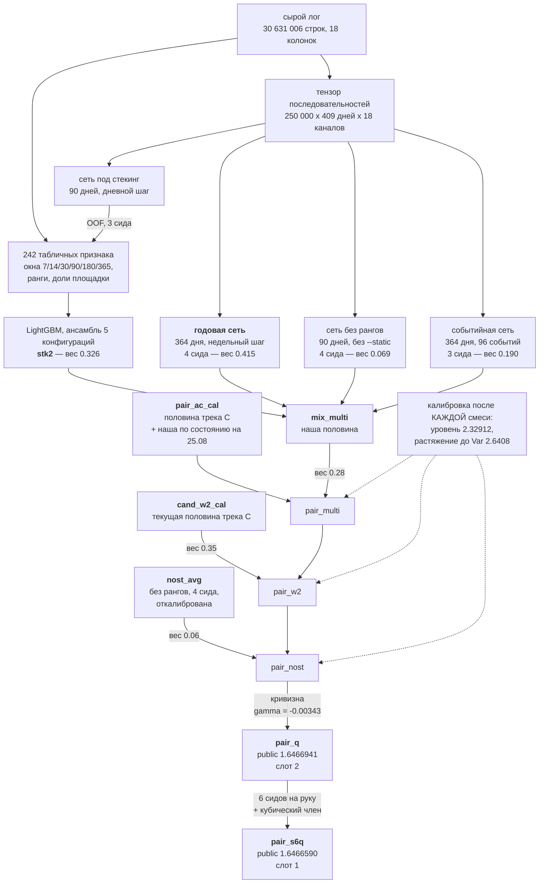

# Решение задачи 3: с чего начать чтение

Предсказание суммарного GMV пользователя Поиска за 30 дней (14.02–15.03.2026)
по дневному логу активности. Метрика — RMSLE.

**Итог: public RMSLE 1.6466590** (`pair_s6q.csv`).
Вторым слотом — `pair_q.csv`, 1.6466941.

Порядок слотов на счёт не влияет: в зачёт идёт лучшее из двух, поэтому
решается только состав пары. Он выбран **по разделённости, а не по лучшему
публичному счёту** — обоснование в [`A2`](A2_final_selection.md), раздел
«Закон про направление работает и на уровне слотов».

---

## Что такое наше решение в четырёх абзацах

**Основа — градиентный бустинг на 242 агрегатах** дневного лога: оконные
суммы за 7/14/30/90/180/365 дней, пожизненные величины, доли в дневном объёме
площадки, отношения и ранги. Ранги здесь не украшение: уровень площадки
за год вырос вдвое, поэтому абсолютные рубли означают в январе и в мае разное,
а положение клиента среди прочих — одно и то же.

**Поверх него — четыре рекуррентные сети**, и различаются они не архитектурой,
а тем, **что видят**: 90 дней дневным шагом, 364 дня недельным, 364 дня
в виде 96 событий вместо календарной сетки, и та же дневная сеть, намеренно
лишённая статических рангов. Одна из них входит признаком в бустинг
(стекинг), три соединяются с ним весами.

**У всех сетей распределительная голова**: они предсказывают распределение
по 64 бинам и учатся кросс-энтропией, а предсказание берётся как среднее
`Σ pₖcₖ`. Нулю отведён отдельный бин — `log1p(0) = 0` ровно, и там сидит 46%
клиентов. Это не оформление, а то, что дало результат: замена головы принесла
+0.00110 и +0.00203 через стекинг.

**Наконец — калибровка, и она отдельная часть решения.** Уровень тестового
окна измерен зондом лидерборда (локально он невыводим: средний `log1p(GMV)`
по девяти окнам растёт немонотонно, и экстраполяция промахивается на 0.167,
что стоило бы +0.0084). Растяжение выведено из целевой дисперсии, кривизна —
решением из одного зонда. Половина трека C входит в состав равным весом.

---

## Схема решения

Все четыре сети — **одна архитектура GRU** с распределительной головой
на 64 бина. Различаются только тем, **что видят**.

Две вещи, которые видно на схеме и теряются в тексте. Первая: сеть под
стекинг входит **в бустинг признаком**, а не в смесь — это разные способы
соединения, и в различии весь смысл стекинга. Вторая: половины трека C
входят на **разных шагах** — `pair_ac_cal` первым, `cand_w2_cal` вторым,
и внутри первой зашита наша половина месячной давности.

Сеть без рангов участвует **дважды**: одиночным прогоном внутри `mix_multi`
(вес 0.069) и усреднённой по четырём сидам на последнем шаге (вес 0.06).
Это не дублирование, а измеренный результат: усреднение сидов меняет форму
ошибки достаточно, чтобы вторая копия платила.

Пересобирается двумя командами со сверкой: `rebuild_final.py` — отправленные
файлы (расхождение 4·10⁻¹²), `rebuild_comp.py` — основание всех замеров
направления (2.7·10⁻¹⁵).

## Кто что сделал

Команда из двух активных треков плюс материалы жюри.

| | коммитов | что сделано |
|---|---|---|
| **трек A** (Svetlana Tsykunova) | 315 | признаки и бустинг (`features/`, `train.py`), состав и цепочка смесей, калибровка и зонды лидерборда, вероятностная часть состава, аудиты (`leak_audit`, `doc_audit`, `rebuild_final`, `rebuild_comp`), материалы жюри |
| **трек C** (neonalex603) | 94 | рекуррентные сети целиком (`seq_train.py`, `seq_data.py`), измерительная дисциплина: шумовой пол двойником, починка ранней остановки, `partner.py`, `fresh.py`, `residual.py`, `lgb_grid.py` |
| прочие | 5 | вспомогательное |

**Половина состава пришла от трека C** — файлы `cand_w` и `cand_w2`, входящие
через `pair_ac_cal` и `cand_w2_cal`. Внутри `pair_ac` зашита **наша половина
по состоянию на 25.08**, и мы её намеренно не обновляли: проверка показала,
что обновление улучшает компоненту на 0.00019 и **ухудшает состав
на 0.00020**.

Ключевые находки тоже распределены: закон про направление и калибровка —
трек A; шумовой пол двойником и починка ранней остановки (+0.00112) —
трек C. Приём «измерь известное, прежде чем мерить неизвестное» найден
**двумя треками независимо** и с разных сторон.

## Почему такой путь, а не другой

**Главный закон, вокруг которого собрано решение:**

> Расстояние ничего не значит, значит направление.

Партнёр по составу полезен ровно настолько, насколько его отличие от нас
направлено **против** нашей ошибки: выигрыш равен `(D − δ)²/(4D)`, где
`D` — расстояние, `δ` — отставание. Из этого следует всё остальное.

**Отсюда — почему сети различаются входом, а не устройством.** Семь
альтернативных функций потерь увеличили расстояние в 17 раз и дали **ноль**.
Табличная нейросеть на тех же 242 признаках — ноль. Сеть на остатке
бустинга — ноль. Меняя форму гипотезы при том же входе, направления
не получить; меняя вход — можно. Годовая сеть при расстоянии 0.004 принесла
+0.00138, тогда как равноудалённые кандидаты при 0.069–0.081 давали +0.0002.

**Отсюда же — почему самый ценный партнёр хуже всех остальных.** Сеть
без статических рангов проигрывает базе 0.037 и была забракована как
испорченный замер. Лишённая рангов, она вынуждена опираться на одну
последовательность и ошибается иначе — и даёт +0.00074 сверх годовой сети.

**И почему улучшение компоненты может навредить.** Половина трека C внутри
`pair_ac` смешана с нашей половиной **по состоянию на 25.08**. Мы попробовали
освежить её нынешней: половина стала лучше на 0.00019, а состав — **хуже
на 0.00020**. Обновление вдвое сократило расстояние до остальной цепочки,
и оптимальный вес партнёра ушёл в минус. Устаревшая половина ценна именно
тем, что устарела.

---

## Что в решении работает — и сколько дало каждое

Отвергнутых направлений пятьдесят два, принятых пять. Соотношение стоит
читать вместе с величинами, иначе оно вводит в заблуждение.

| принято | вклад | где измерено |
|---|---|---|
| распределительная голова (64 бина) | **+0.00110 / +0.00203** через стекинг | два валидационных среза |
| годовая сеть как партнёр | **+0.00138** при расстоянии всего 0.004 | лидерборд |
| сеть без статических рангов | **+0.00074** сверх годовой | лидерборд |
| калибровка: уровень, растяжение, кривизна | **+0.0084 / +0.00016 / +0.000042** | зонды лидерборда |
| смесь распределений (вероятностный выход) | CRPS **+0.00174 / +0.00318** | два валидационных среза |

Пятое принято 29.08 и относится к вероятностному выходу, а не к сабмиту:
распределение состава собиралось у одной сети из четырёх, теперь у всех.
Оптимальный масштаб при этом стал **общим для срезов** (1.08 против 1.12
и 1.16 у одной сети) — параметр перестал быть подгоняемым.

**Три формы иерархии, которые работают и входят в решение:**

* **двухголовое разложение** `E[log1p(y)] = P(покупка)·E[log1p(y)|покупка]` —
  точное, потому что `log1p(0) = 0`; даёт лучший Gini среди голов;
* **стекинг** — бустинг решает **поклиентно**, где верить сети; условная
  на клиенте комбинация, а не общий вес: внутри стекинга две сети
  не вытесняют друг друга (+0.00037 / +0.00080), внутри бленда вытесняют;
* **частичное объединение в BG/NBD** — выведено из правдоподобия, не подобрано:
  вес личного среднего растёт с числом покупок, `w = p·x/(p·x + q − 1)`.

## Что отвергнуто и почему это половина работы

В `A4` — **пятьдесят два направления**, каждое с числом и с условием, при
котором вывод изменился бы. Отрицательный результат без такого условия —
мнение; с условием — измерение.

**Правил приёмки два, потому что приборов два.** Это важно, иначе таблица
принятого выше выглядит противоречащей порогу.

| прибор | шум | порог приёмки | почему такой |
|---|---|---|---|
| валидация, два среза | разброс между срезами ~0.001 | **0.002** и согласный знак | заведён 25.08 по устойчивости годовой сети: почти всё измеренное расходилось между срезами вдвое или меняло знак |
| публичный лидерборд | парная σ 0.0001–0.0004 | **≈5·10⁻⁵** | предел разрешения, измеренный алгеброй; ниже него прибор не различает |

Поэтому годовая сеть (+0.00138 на лидерборде) и сеть без рангов (+0.00074)
приняты, хотя обе ниже 0.002: на лидерборде это 2–7σ. А кубический член
калибровки (+5.1·10⁻⁶) отвергнут, хотя он положителен: там 0.7σ.

Самая многочисленная группа отвергнутых — те, где знак не сошёлся между
валидационными срезами: плюс на одном окне, минус на другом, то есть
измерялся шум.

**Оговорка, которую делаем сами.** Порог 0.002 и правило двух срезов
заведены **25.08**, а часть решения сложилась раньше. Единственный случай,
где валидация ошиблась против лидерборда — «ранги датчиков времени»,
+0.00036 / +0.00077 против −0.00079 на public — измерялся **21.08**,
то есть до правила; сегодняшнее правило его бы и не пропустило (обе
величины ниже 0.002). Мы это проверили, а не предположили.

Крупнейшие из закрытых направлений:

| направление | результат |
|---|---|
| вход исчерпан | **доказательство**: 4 колонки `has_*` тождественны другим на всех 30 631 006 строках |
| состав в оптимуме | все 57 отправленных за месяц файлов как партнёры: лучший **+6.6·10⁻⁶** |
| веса цепочки | совместная переоптимизация хуже жадной при переносе |
| иерархия | проверена в **четырёх** формах, ни одна не переносится между срезами |
| калибровка | изотоника переобучается, кубический член ниже предела разрешения |

---

## Вопрос, который зададут первым: почему не первое место

Разрыв с лидером — **0.0014481**, то есть **0.09% величины нашей ошибки**.
Оракульные потолки в этой задаче измеряются десятками процентов: соревнование
идёт за доли процента, а не за пропущенный механизм.

Разрыв с пятым местом — **0.0005508** (снимок 28.08), и это **меньше смещения отбора**:
у любого, кто выбирал финал по public даже из десяти попыток, ожидаемая
переоценка составляет 0.00079. Наш рекорд получен **построением, а не
отбором** — веса взяты с валидации, калибровка вычислена офлайн, результат
предсказан до отправки четырнадцать раз, последний с промахом 1.8·10⁻⁹.
Такой файл смещения отбора не несёт.

Мы не утверждаем, что на private окажемся выше. Утверждаем, что **арифметика
симметрична**, и применяем её к себе так же, как к соперникам: разбор
в `A2`, раздел про смещение отбора.

## Чего мы НЕ утверждаем

Честность здесь дороже полноты, поэтому границы названы прямо.

* **Сквозная воспроизводимость на чужой машине не проверена.** Проверена
  на одной: признаки и все четыре сети совпадают **побитово**, бустинг
  расходится на 0.00018 — внутри независимо измеренного шумового пола 0.00081.
* **Иерархия как ДОПОЛНИТЕЛЬНОЕ улучшение не сработала** ни в одной
  из четырёх проверенных форм: когортные приоры в средних, масштаб разброса,
  веса состава, ужатие по неопределённости. Структура в данных есть (масштабы
  коррелируют между окнами +0.785), метода из неё не вышло.
  Три формы, которые **работают**, перечислены ниже и входят в решение.
* **Распределение состава консервативно, и его форма неверна.** CRPS просит
  один масштаб, попадание в интервалы — другой; примирить одним числом
  нельзя, и мы показываем оба.
* **Порождающая модель проигрывает бустингу 0.23 RMSLE.** Она в решении
  не участвует и служит независимой проверкой оценки суммарного GMV.

---

## Чем это решение ценно — коротко

Метрика у верхних мест отличается на доли процента: **разрыв с лидером
составляет 0.09% величины нашей ошибки**. В таком режиме решение отличает
не модель, а **дисциплина измерения**, и именно её мы предъявляем.

**1. Мы измеряем то, что нельзя измерить дважды.** Публичный лидерборд —
не таблица результатов, а прибор с одним отсчётом в сутки. Мы научились
решать по нему коэффициенты **точно**: уровень тестового окна, целевую
дисперсию, кривизну — каждый из одного зонда, через алгебру, а не подбором.
Четырнадцать предсказаний записаны **до** отправки, последнее промахнулось
на 1.8·10⁻⁹.

**2. И мы измерили границы этого прибора.** Их четыре, и последняя —
разрешающая способность ≈5·10⁻⁵, которая **не зависит от шага зонда**
(`σ_a ∝ σ_пары/γ`, а `σ_пары ∝ γ`).

Эта граница не осталась теорией — она поймала нас за руку 30.08. Три файла,
отличавшиеся усреднением по сидам, дали на паблике 1.6466941, 1.6466590
и 1.6466757: **размах 3.5·10⁻⁵, то есть весь разброс уместился ниже
разрешения**. Модель предсказывала эффект ≈2·10⁻⁶ на шаг, а наблюдались
качели ±2σ парного шума. Мы приняли одно отклонение в 1.25σ за сигнал,
перекалибровали по нему модель в пятнадцать раз и получили файл **хуже**
предыдущего. Разбор обеих ошибок — в [`A2`](A2_final_selection.md), и он
в решении ценнее самого результата: **знать, чего прибор не различает,
важнее, чем выжать из него ещё знак.**

**3. Один закон объясняет весь состав — и, как выяснилось, не только его.**
«Расстояние ничего не значит, значит направление» — не метафора, а формула
`(D − δ)²/(4D)`, проверенная шестью случаями в обе стороны. Из неё следует,
почему сети различаются **входом**, а не архитектурой; почему самый ценный
партнёр **хуже** всех остальных на 0.037; и почему обновление компоненты
**навредило** составу.

А в последний день закон оказался шире. Площадка даёт две галочки и берёт
**лучшее** из двух, то есть минимум — и ценность второго слота растёт
с разделённостью кандидатов, а не с их качеством. Наш `pair_s12q`
конструктивно лучше `pair_s6q`, и всё равно проигрывает ему в паре.
**Тот же закон управляет выбором финала, а не только устройством модели.**

**4. Отрицательных результатов больше, чем положительных, и они дороже.**
Пятьдесят два направления, каждое с числом и **с условием, при котором вывод
изменился бы**. Отрицательный результат без такого условия — мнение;
с условием — измерение, которым можно пользоваться.

**5. Мы ищем ошибки у себя раньше, чем их найдут у нас.** Аудит утечки цели
на 727 прогонах обоих треков, включая журналы веток. Пересборка отправленных файлов и основания
всех замеров. И честные истории провалов: метод прогноза, **перевернувший
знак решения**; отзыв прибавки +0.00669 её же автором **в день**, когда он
писал раздел про эту ловушку; три блокера инструкции, найденные сквозным
прогоном за сутки до сдачи.

**6. Мы называем границы прямо.** Иерархия как дополнительное улучшение
не сработала ни в одной из четырёх форм. Форма распределения неверна,
и мы показываем оба несогласных критерия вместо удобного. Последние сутки
работы дали **ноль измеримого улучшения**, и мы пишем это прямо, а не прячем
за списком проделанного.

Воспроизводимость на другой машине проверена **29–30.08**: участник другого
трека прошёл инструкцию на своём железе и получил 1.68209 против эталонных
1.68190 — расхождение 1.9·10⁻⁴ при пороге приёмки 10⁻³. Заодно этот прогон
нашёл в инструкции ссылку на выбывший артефакт: честно выполнив её, читатель
объявил бы репозиторий невоспроизводимым. Дефект чинён, и на него заведена
**механическая проверка** ([`doc_audit.py`](../../src/doc_audit.py)), которая
на месте нашла второй такой же.

> Если из решения стоит взять одно — то приём, найденный двумя треками
> независимо: **прежде чем измерять неизвестное, измерь известное
> и проверь, что прибор его показывает.**

## Порядок чтения

**Если есть десять минут:**

1. [`B3_pitch.md`](B3_pitch.md) — что показывать и почему, с числами.
   Раздел 4 — четыре найденных предела нашего измерительного прибора,
   раздел 7 — опасения, которые мы назвали сами, и чем каждое закрыто.

**Если есть час:**

2. [`A2_final_selection.md`](A2_final_selection.md) — выбор двух финальных
   решений, цена каждой подгонки под public и прямой ответ на предупреждение
   организаторов об оверфите.
3. [`A4_negative_results.md`](A4_negative_results.md) — пятьдесят два
   отвергнутых направлений, разложенных **по причине отказа**: знак
   не сошёлся, величина ниже порога, подогнать удаётся а перенести нет,
   непохоже но вклада нет, эффект есть но прибор его не различает.
   У каждого — условие, при котором вывод изменился бы.
4. [`A3_probabilistic.md`](A3_probabilistic.md) — три части: вероятностность
   рабочей модели (то, что идёт в сабмит), иерархия в четырёх формах
   и порождающая модель как независимая проверка.

**Если проверяете воспроизводимость:**

5. [`B1_reproducibility.md`](B1_reproducibility.md) — три скрипта проверки
   и критерий приёмки для чужой машины.
6. [`B1_run_report.md`](B1_run_report.md) — протоколы прогонов, включая
   сквозной на боевых данных 29.08 и три блокера, которые он нашёл.

**Остальное:**

7. [`A1_resources.md`](A1_resources.md) — ресурсы и ограничения.
8. [`B2_tiebreakers.md`](B2_tiebreakers.md) — оценки для тай-брейкеров.
9. [`C1_measurement.md`](C1_measurement.md), [`C2_track_c.md`](C2_track_c.md)
   — измерительная дисциплина и предел задачи, сведённый в семь измерений
   с числами, а не в перечень отказов.
10. [`C3_reproduce.md`](C3_reproduce.md) — пакет воспроизведения: конфигурации,
   ожидаемые числа и критерий приёмки (0.001 на январе, 0.002 на декабре).
   Читать тому, кто хочет повторить решение на своей машине.

Воспроизведение решения — в корневом [`README.md`](../../README.md),
раздел «Запуск». Инструкция пройдена целиком на боевых данных 29.08.
